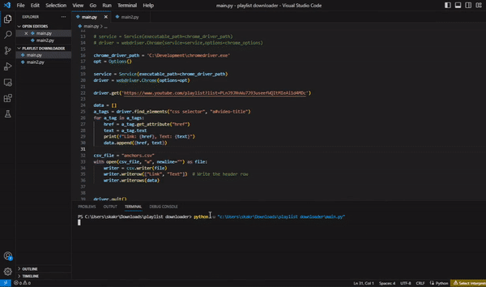
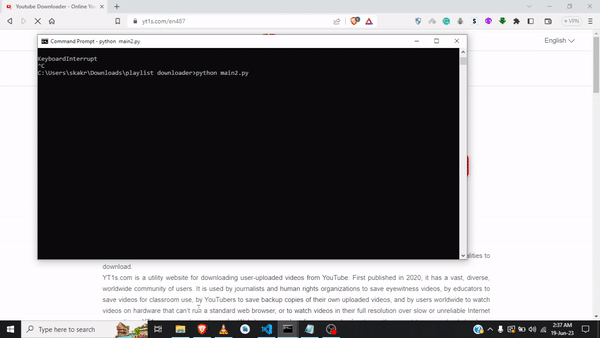
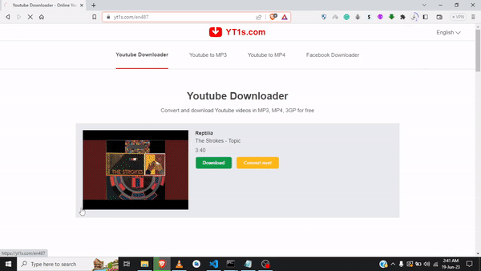
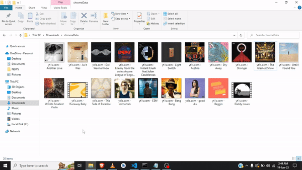

# youtube-playlist-downloader
It uses selenium webdriver for scrapping the playlist videos and then load it on a third party youtube video downloader one by one automatically.

## step 1:
clone the project
## step 2: 
install chromedriver.exe
## step 3: 
get the chrome application path
## step 4: 
open cmd and cd to the chrome.exe and run chrome.exe --remote-debugging-port=8080
note- you can change the port no
## step 5: 
replace the video playlist then run the videos_scrapper.py file
## step 6: 
check for the csv file anchors.csv
## step 7: 
run the downloader.py

  
  

  
  

 

  
  

  

  
  

